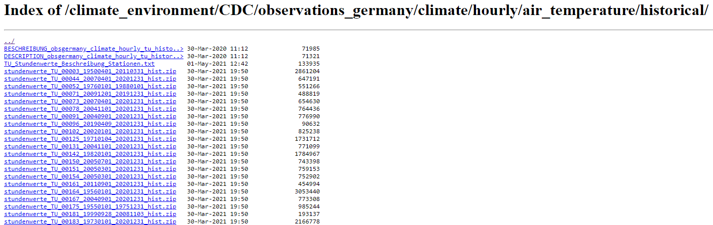
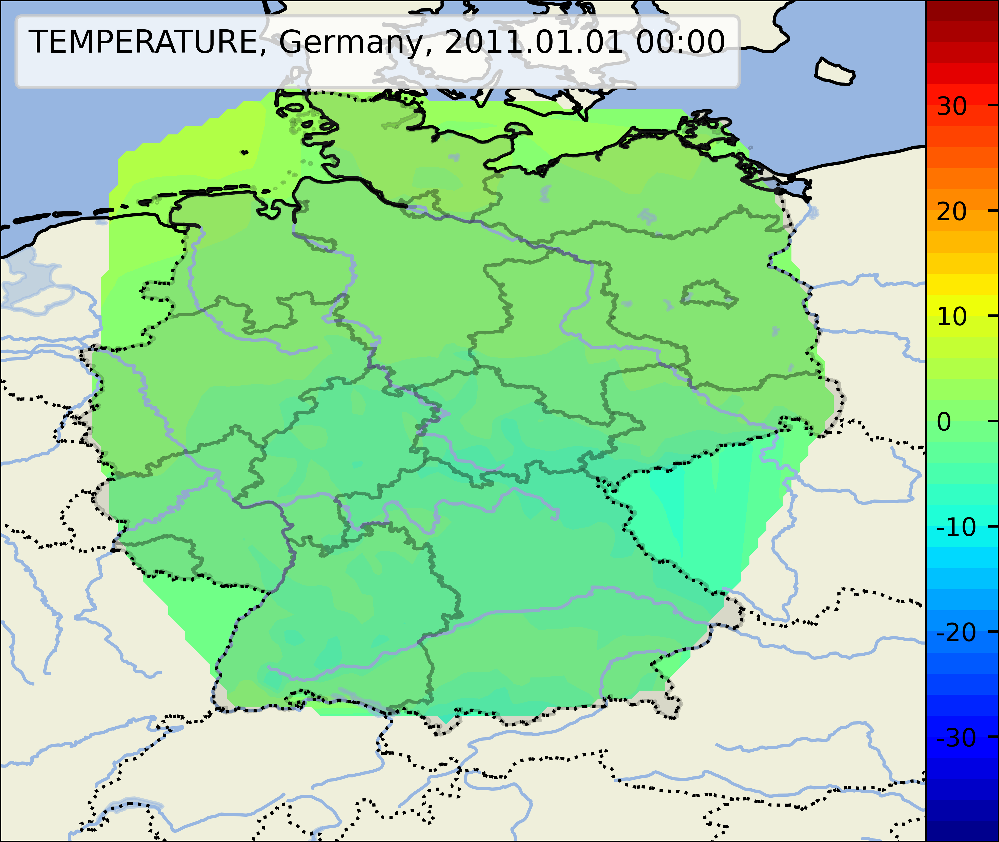
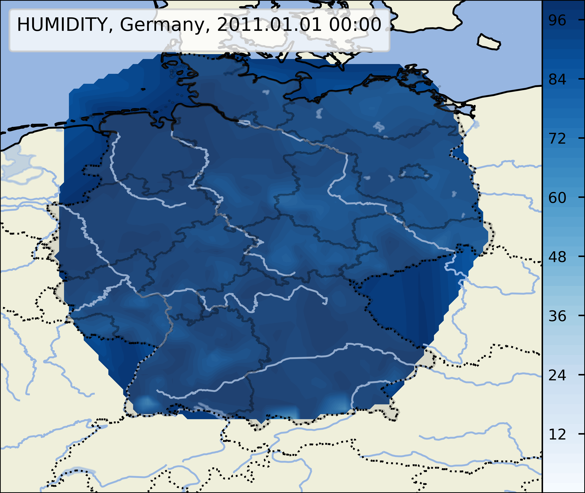
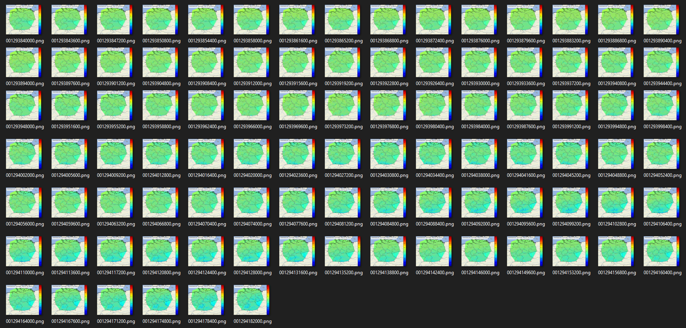

# Weather-Data-Visualizer
A tool for visualizing weatherdata
*created by: Anton Böhler, Jan Broer, Alexander Dietrich*

view on [github](https://github.com/AntVil/Weather-Data-Visualizer)

## Overview
### In-scope
- downloading data from [dwd](https://opendata.dwd.de/climate_environment/CDC/observations_germany/climate/hourly/air_temperature/historical/)
- unzip data
- format & clean data
- plots of moments in time
- videos of time ranges
- interface for user-input

### Out-of-scope
- multiple weatherdata sources
- location detection
- select concrete locations
- satellite images

### Goal
The goal of this project is to visualize the archived weatherdata from dwd using an intuitive interface. The resulting images or videos can then be saved. The software should run locally on ones machine. It should work on systems like `mac` or `linux`, but was created and tested soly on `windows`.

## Implementation
### The data
The data is located on the [dwd server](https://opendata.dwd.de/climate_environment/CDC/observations_germany/climate/hourly/air_temperature/historical/), accessing their website we get this view:
  
Each file can be downloaded and unzipped:
  
The measurements are in a csv-format and contain the date, temperature, relative humidity and other values:
  
But some values are missing or replaced by `-999`:
  
The geography is also in csv-format:
  
The measurements are spatially not always at the same place. Some timeranges don't even have a location. Often the end date of the last timerange is not given.

The file [dwd.py](../src/dwd.py) is responsable for downloading the zipfiles and converting them to a more flexible format.
The results are [pandas DataFrames](https://pandas.pydata.org/docs/reference/api/pandas.DataFrame.html#pandas-dataframe) stored as [parquet-files](https://www.youtube.com/watch?v=VZykcApkz_4).
  
The date information is converted to `utc` [datetimes](https://docs.python.org/3/library/datetime.html) and all other values are converted either to int or float to reduce file size.

### Plotting
To create plots of maps [matplotlib](https://matplotlib.org/) and [Cartopy](https://scitools.org.uk/cartopy/docs/latest/matplotlib/intro.html) work together:
  
The map can be cropped to only display germany:
  
By downloading the shapefiles of administrative areas in germany from [GADM](https://gadm.org/download_country_v3.html), more context can be added to the plots:
  
Since the license of `GADM` doesn't permit further distribution the file [shapes.py](../src/shapes.py) downloads and saves the shapefiles locally.

The plot can be further cropped to specific locations:
  
Using [dwd.py](../src/dwd.py) we can get the coordinates of the stations and plot them on the map:
  
The subpackage [matplotlib.tri](https://matplotlib.org/stable/gallery/images_contours_and_fields/irregulardatagrid.html) makes it possible to interpolate values between the stations, like temperature:
  
or humidity:
  

The file [plot.py](../src/plot.py) is responsable for creating these plots.

### Converting to video
Using [imageio](https://imageio.readthedocs.io/en/stable/) and the special plugin `imageio-ffmpeg` images like these:
  
can be converted to a video like this (`gif` for easy display):
  

The file [image_to_video.py](../src/image_to_video.py) makes this conversion.

Using the plots as inputs we can convert our plots:
  
to a video (`gif` for easy display):
  

### The Interface
Using [excalidraw](https://excalidraw.com/) a basic wireframe of the interface can be created:
  

The logo of this project was created using [gimp](https://www.gimp.org/):
  

Using the library [Eel](https://github.com/ChrisKnott/Eel) an interface can be build using `HTML/CSS/JS`. This library specializes in creating simple interfaces for offline python applications. ([tutorial](https://medium.com/@utsav_datta/create-html-user-interface-for-python-using-eel-library-bab101cc0f99))
  
Eel helps to structure the project more and in addition to that it doesn't have as many limitations as Tkinter.

## Result
### Summary
- 

### Known issues
- lack of speed
- no automatic downloading of new data after first setup

### Potential features
- optimize data structuring
- optimize plotting speed

## Dependencies
### System dependencies
- Web-Browser
- Python 3.8

### Python dependencies
- bottle
- bottle-websocket
- Cartopy
- certifi
- cffi
- chardet
- cycler
- Eel
- future
- gevent
- gevent-websocket
- greenlet
- idna
- imageio
- imageio-ffmpeg
- kiwisolver
- matplotlib
- numpy
- pandas
- Pillow
- pyarrow
- pycparser
- pyparsing
- pyshp
- python-dateutil
- pytz
- requests
- scipy
- Shapely
- six
- urllib3
- whichcraft
- zope.event
- zope.interface
