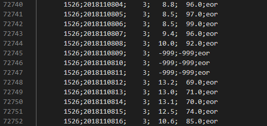

# Weather-Data-Visualizer

### The data
The data is located on the [dwd server](https://opendata.dwd.de/climate_environment/CDC/observations_germany/climate/hourly/air_temperature/historical/), accessing their website we get this view:

Each file can be downloaded and unzipped:

The measurements are in a csv-format and contain the date, temperature and relative humidity and other values:

But some values are missing or replaced by `-999`:

The geography is also in csv-format:

The measurements are spatially not always at the same place. Some timeranges don't even have a location. Often the end date of the last timerange is not given.

The file [dwd.py](../src/dwd.py) is responsable for downloading the zipfiles and converting them to a more flexible format.
The results are [pandas DataFrames](https://pandas.pydata.org/docs/reference/api/pandas.DataFrame.html#pandas-dataframe) stored as [parquet-files](https://www.youtube.com/watch?v=VZykcApkz_4).

The date information is converted to `utc` [datetimes](https://docs.python.org/3/library/datetime.html) and all other values are converted either to int or float to reduce file size.

### Plotting
To create plots of maps [matplotlib](https://matplotlib.org/) and [Cartopy](https://scitools.org.uk/cartopy/docs/latest/matplotlib/intro.html) work together

The map can be cropped to only display germany:

[plot.py](../src/plot.py)

### Converting to video
[imagetovideo.py](../src/imagetovideo.py)

### The Interface
[excalidraw](https://excalidraw.com/)

